# FORMULARIO DE CADASTRO
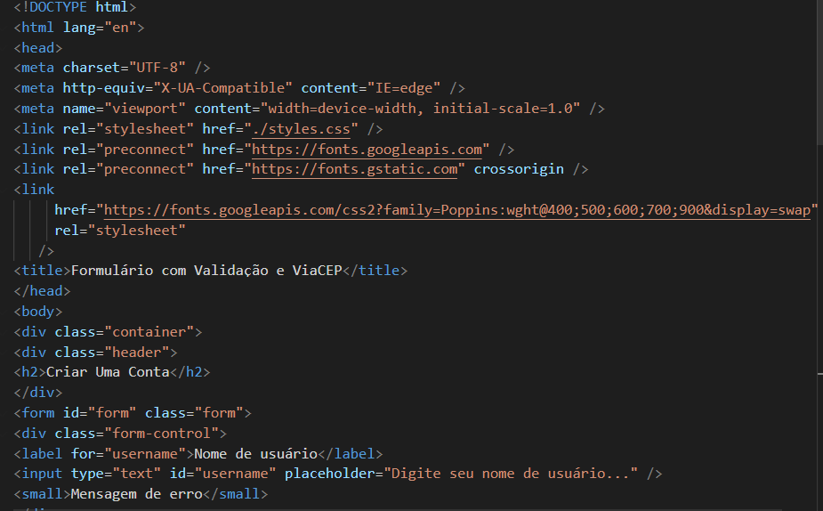
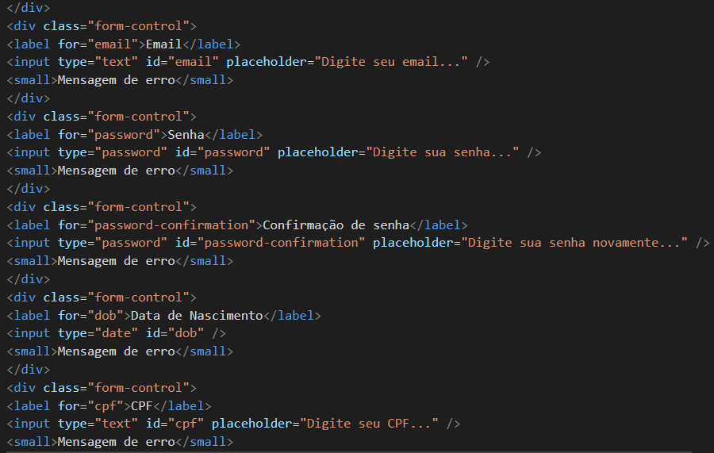
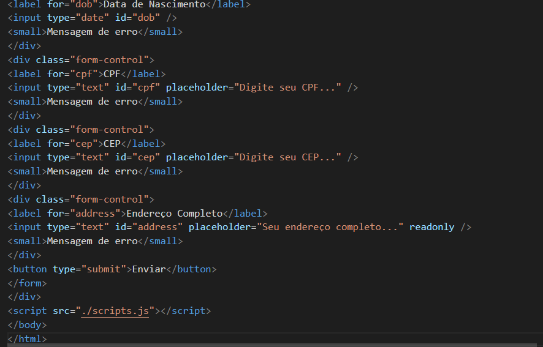
Descrição dos Elementos
Cabeçalho (<head>):

Define a codificação de caracteres como UTF-8.
Configura a compatibilidade com o Internet Explorer.
Inclui a folha de estilos styles.css e fontes do Google Fonts.
Corpo do Documento (<body>):

Contém um contêiner principal que abriga o cabeçalho e o formulário.
Formulário (form):

### Composto por vários campos de entrada (input):
Nome de usuário
Email
Senha
Confirmação de senha
Data de nascimento
CPF
CEP
Endereço Completo (campo somente leitura que será preenchido automaticamente)
Cada campo possui uma etiqueta (<label>) e uma área para mensagens de erro (<small>).
Botão de Envio:

Um botão que, ao ser clicado, tentará enviar os dados do formulário.
Script:

Inclui o arquivo scripts.js, onde a lógica de validação e integração com ViaCEP deve ser implementada.
Funcionalidades
Validação de Campos: O formulário deve validar os campos para garantir que sejam preenchidos corretamente (a validação deve ser implementada no scripts.js).

### Integração com ViaCEP:
 Ao inserir o CEP, o campo de endereço é preenchido automaticamente com as informações correspondentes (também a ser implementado no scripts.js).

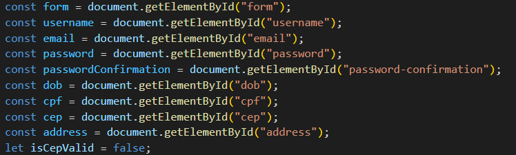

Esses comandos capturam os elementos do formulário e inicializam uma variável para rastrear a validade do CEP.

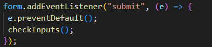

Quando o formulário é enviado, a função checkInputs é chamada para validar os campos.

Validação de Campos: A função checkInputs verifica cada campo para garantir que os dados inseridos sejam válidos:

Nome de usuário
Email
Senha e confirmação de senha
Data de nascimento
CPF
CEP

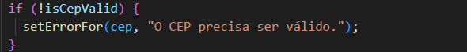

Exibição de Erros e Sucessos: As funções setErrorFor e setSuccessFor são responsáveis por atualizar a interface do usuário com mensagens de erro ou de sucesso.

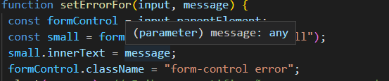

## Validação de Email e CPF:

A função checkEmail utiliza uma expressão regular para validar o formato do email.
A função validateCPF valida o CPF de acordo com a lógica brasileira.

## Integração com ViaCEP: A função fetchAddressByZipCode é chamada ao perder o foco do campo CEP. Ela busca o endereço correspondente ao CEP informado.

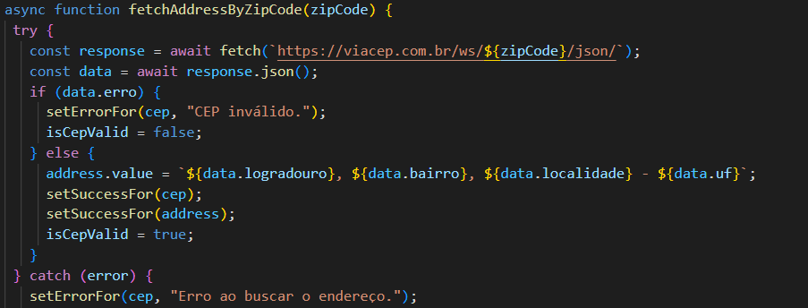

# Tecnologias Utilizadas
## HTML
## CSS
## JavaScript

# IMAGENS DO PROJETO

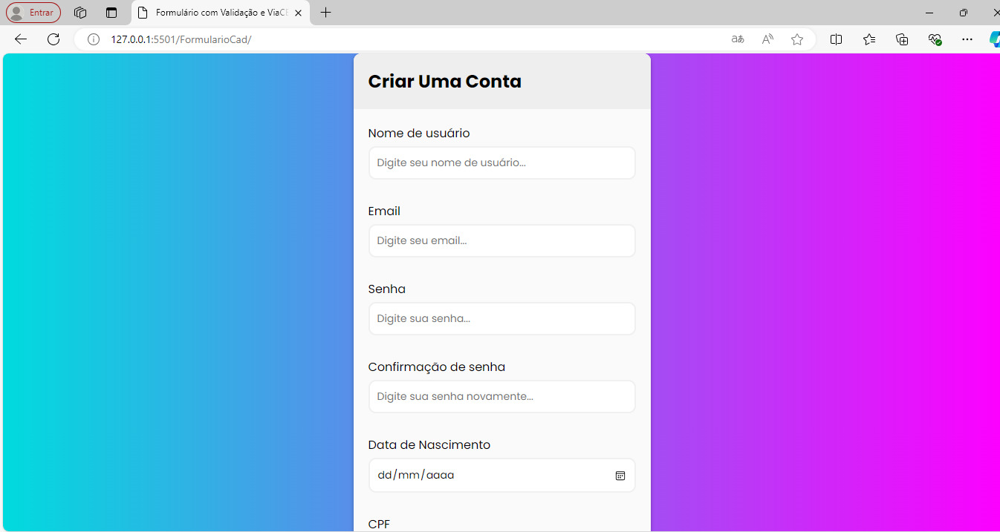

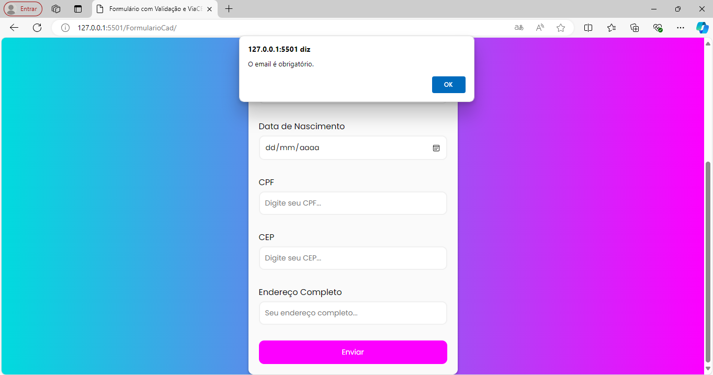
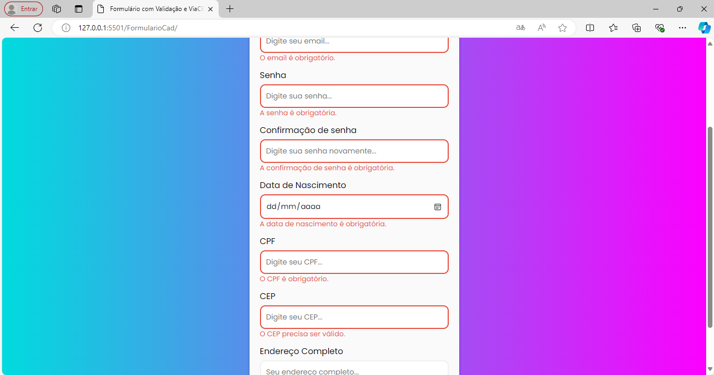